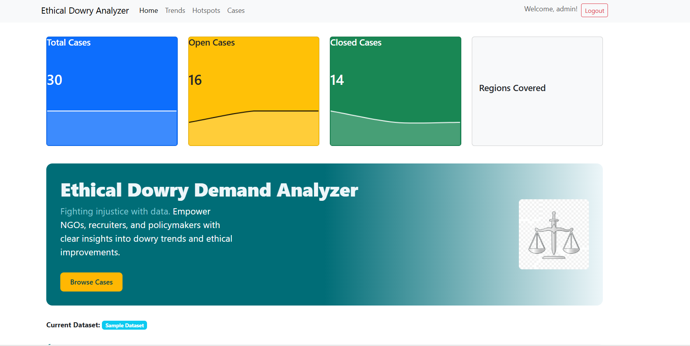
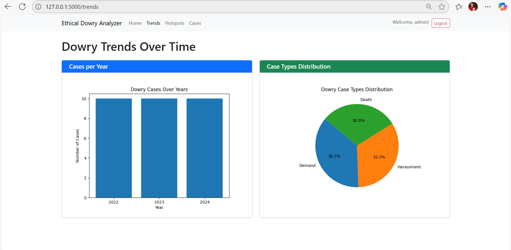
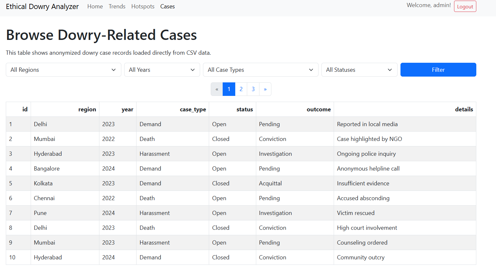
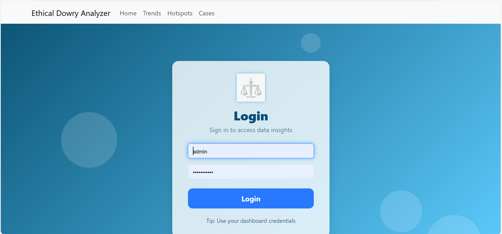

# Ethical Dowry Analyzer

Analyze, visualize, and combat unethical dowry demands with interactive data tools.

---

## Overview

**Ethical Dowry Analyzer** is a modern dashboard for exploring dowry-related case data in India. It empowers NGOs, policymakers, and recruiters with actionable insights and trends via rich, interactive visualizations, region-based mapping, and an ethical case browser.

---

## Features

- **Dashboard Summary Cards:** Key metrics for total, open, closed cases, and regions.
- **Trends Visualization:** Interactive, animated charts for year-wise and type-wise analysis.
- **Hotspot Maps:** Region-level mapping of dowry case density.
- **Cases Explorer:** Filterable, paginated, and downloadable table of all case data.
- **Data Upload/Admin:** CSV import for updating datasets.
- **Authentication:** Secure login UI with modern effects.
- **Responsive Design:** Works beautifully on desktop or mobile.
- **Elegant UI:** Animations, gradients, interactivity, and a recruiter-ready look.

---

## Demo

> 
> 
> 
> 

---

## Tech Stack

- **Backend:** Flask, Python, Pandas
- **Frontend:** Bootstrap 5, Chart.js, Leaflet.js
- **Data:** CSV (no external DB needed)
- **Authentication:** Flask-Login

---

## Installation

1. **Clone the repository**  
   `git clone https://github.com/yourusername/ethical-dowry-analyzer.git`

2. **Create a virtual environment**  
   `python -m venv venv && source venv/bin/activate` (*Windows: `venv\Scripts\activate`*)

3. **Install dependencies**  
   `pip install -r requirements.txt`

4. **Run the app**  
   `flask run`

5. Open http://localhost:5000 in your browser.

---

## Usage

- Log in with admin credentials.
- Browse dashboard metrics and trends.
- Use filters, maps, and download CSVs.
- Admins: upload a new dataset anytime via UI.

---

## Folder Structure
dowry_analyzer/
│
├── app.py
├── requirements.txt
├── README.md
│
├── Data/
│ └── dowry_cases_sample.csv
│
├── docs/
│ ├── screenshot_dashboard.png
│ ├── screenshot_trends.png
│ ├── screenshot_cases.png
│ └── screenshot_login.png
│
├── static/
│ ├── css/
│ ├── indian_states_sample.geojson
│ └── justice.png
│
├── templates/
│ ├── base.html
│ ├── cases.html
│ ├── hotspots.html
│ ├── index.html
│ ├── login.html
│ ├── trends.html
│ └── upload_csv.html
│
└── uploads/
---

## Contributing

Fork this repo and submit a pull request.  
Feature suggestions welcome via issues or discussion.

---

## License

MIT License. See [LICENSE](LICENSE.txt).

---

## Author

Designed and engineered by [Sheshank Sidheshwar].  
Contact: [sidhusheshank@gmail.com](mailto:sidhusheshank@gmail.com)

---

*Fighting social injustice with data-driven technology.*    

